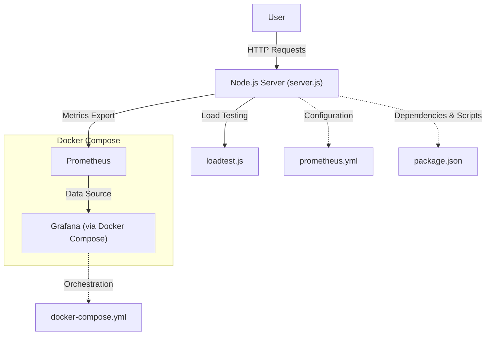

# Grafana Node.js Project

A Node.js-based environment for running and testing Grafana with Prometheus integration. It includes a sample server, load testing script, and Docker Compose setup for local development and monitoring.

## Features
- Node.js server (`server.js`)
- Prometheus monitoring (`prometheus.yml`)
- Load testing script (`loadtest.js`)
- Docker Compose for easy orchestration (`docker-compose.yml`)

## Setup
1. **Install dependencies:**
   ```bash
   npm install
   ```
2. **Configure environment variables:**
   - Copy `.env.example` to `.env` and adjust as needed (if applicable).

## Usage
### Start the Node.js server
```bash
node server.js
```

### Run with Docker Compose
```bash
docker-compose up
```

### Load Testing
You can run the load testing script with:
```bash
node loadtest.js
```

## Project Structure
- `server.js` - Main Node.js server file
- `loadtest.js` - Script for load testing
- `prometheus.yml` - Prometheus configuration
- `docker-compose.yml` - Docker Compose setup
- `package.json` - Project metadata and scripts

## Monitoring
Prometheus is configured via `prometheus.yml` and can be run as part of the Docker Compose setup.

## Contributing
Pull requests are welcome! For major changes, please open an issue first to discuss what you would like to change.

## Architecture

